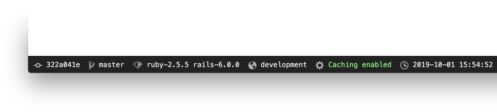

# Staff bar

[](preview.png)

Staff bar is a tiny utility for Ruby on Rails projects. It shows a bar with some basic project information: commit hash, branch, Ruby & Rails versions, environment and caching status. You can also make a list of links that you want to show on a bar for a quick access to your internal tools.

## Usage
```ruby
# Add this to Gemfile
gem 'staff_bar'

# Install dependencies
bundle
```

Add this to `app/views/layouts/application.html.erb`:
```ruby
...
</head>

<body>
  <%= staff_bar if current_user.staff? %>

  <%= yield %>
</body>
...
```

(you can change `current_user.staff?` to whatever your administrators logic is of course.)

Add this to your `application.css` to use default styles:
```css
*= require staff_bar
```

To show current branch, add staff_bar capistrano tasks in `Capfile`:
```ruby
require "staff_bar/capistrano"
```

This will create `BRANCH` file when deploying, which will staff bar use to show the branch.

## Configuration

```ruby
# app/config/initializers/staff_bar.rb
StaffBar.configure do |config|
  config.links = [
    { url: '/jobs', title: 'Jobs queue' },
    { url: '/logs', title: 'Open logs' }
  ];

  config.theme = :dark # or :light
  config.position = :bottom # or :top
end
```

## License
The gem is available as open source under the terms of the [MIT License](https://opensource.org/licenses/MIT).
